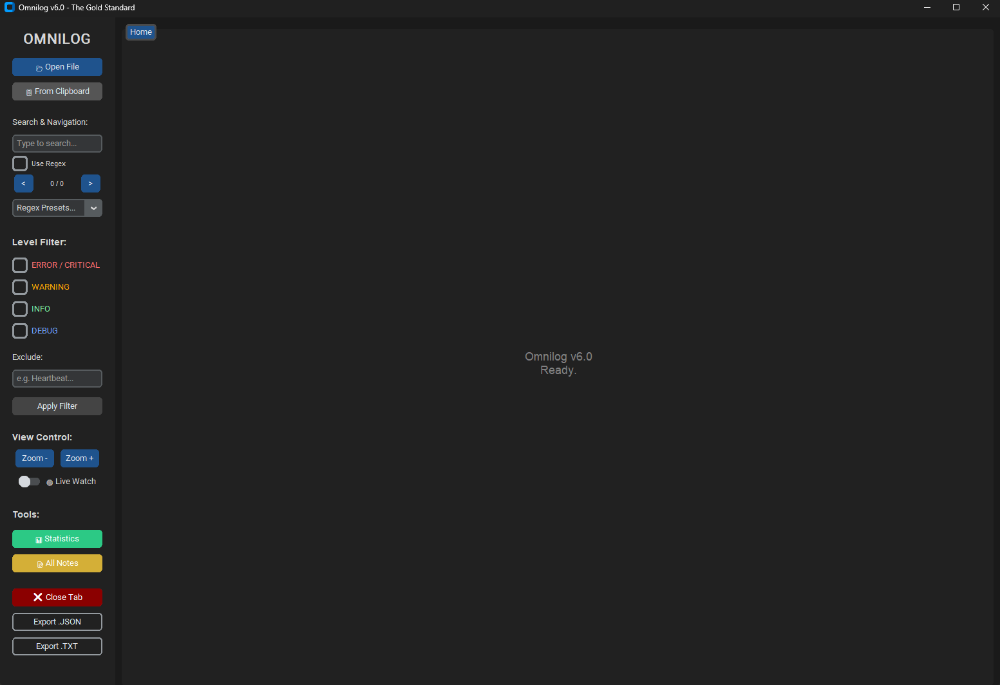

# 📜 Omnilog - The Ultimate Log Analyzer


**Omnilog** is a modern, high-performance log analysis tool designed for System Administrators, DevOps, and Developers. It simplifies debugging by providing a clean, dark-themed interface with powerful search, filtering, and live-monitoring capabilities.



## 🎯 Key Features

* **Zero-Ghosting Line Numbers**
    Custom-built synchronization engine ensures line numbers never overlap or desync, even during heavy filtering.
* **🔍 Advanced Search**
    Includes toggleable **Regex support** with useful presets (IPs, Emails, Dates) and instant navigation through matches.
* **⚡ Smart Filtering**
    Filter logs by level (`ERROR`, `WARN`, `INFO`, `DEBUG`) or use **Exclude Mode** to hide noise instantly.
* **📡 Live Watch (Tail -f)**
    Monitor active log files in real-time. New lines appear automatically as they are written.
* **🧰 Pro Toolset**
    * **Context Search:** Right-click any text to search it on Google immediately.
    * **Marking:** Highlight critical lines in Red, Blue, or Yellow.
    * **Notes:** Add persistent notes to lines and view them in a summary.
    * **Statistics:** Visualize log level distribution with built-in charts.
* **💾 Export Options**
    Save your filtered results or full analysis including annotations as `.txt` or `.json`.

## 📥 Download & Installation

### Option 1: Standalone EXE (Recommended)
No Python installation required. ideal for end-users.

1.  Go to the **[Releases](../../releases)** page.
2.  Download the latest `omnilog.exe`.
3.  Run it.

*(Note: Since this is a self-signed tool, Windows Defender might warn you on the first run. Click "Run anyway".)*

### Option 2: Run from Source
For developers who want to modify the code:

1.  Clone the repository:
    ```bash
    git clone [https://github.com/YOUR_USERNAME/omnilog.git](https://github.com/YOUR_USERNAME/omnilog.git)
    cd omnilog
    ```
2.  Install dependencies:
    ```bash
    pip install -r requirements.txt
    ```
3.  Run the application:
    ```bash
    python omnilog.py
    ```

## 🖱️ Context Menu Integration

To add **"Open with Omnilog"** to your Windows right-click menu:

1.  Open `install_context.py` in a text editor.
2.  Update the `exe_path` variable to point to your `omnilog.exe`.
3.  Run the script as Administrator once.

## 🏗️ How to Build

To compile Omnilog yourself using PyInstaller:

```powershell
py -m PyInstaller --noconsole --onefile --collect-all customtkinter --collect-all tkinterdnd2 omnilog.py
